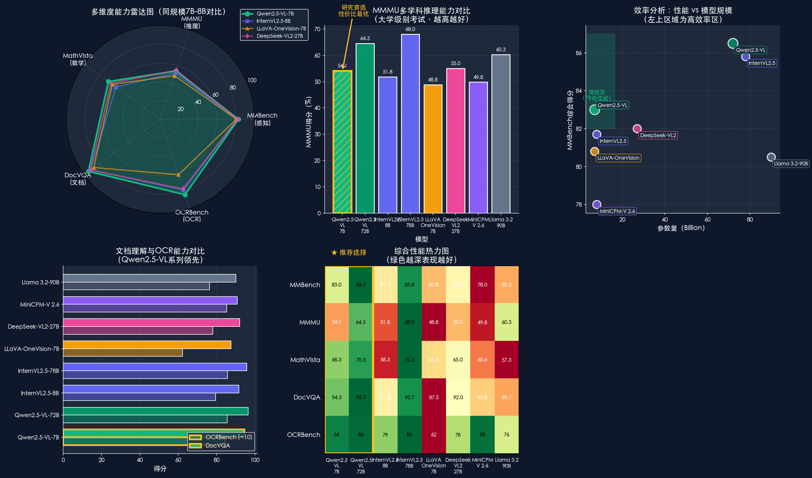

# TV_Assistant - 智能电视助手项目

TV_Assistant 是一个专为智能电视设计的AI助手项目，提供多种功能模块，包括历史人文、影视评论、情感陪伴等。该项目包含数据集生成、模型训练和推理服务等完整流程。

## 项目结构

```
TV_Assistant/
├── data/                  # 数据相关目录
│   ├── dataset/           # 数据集文件
│   │   ├── 历史人文.json           # 历史人文QA数据集
│   │   ├── 影视评论与深度推荐.json   # 影视评论QA数据集
│   │   ├── 情感陪伴.json           # 情感陪伴QA数据集
│   │   ├── 科普百科.json           # 科普百科QA数据集
│   │   ├── 生活方式建议.json        # 生活方式建议QA数据集
│   │   ├── 娱乐八卦与行业资讯.json    # 娱乐八卦QA数据集
│   │   ├── 幽默段子与脑筋急转弯.json   # 幽默段子QA数据集
│   │   └── 各种类型_sharegpt.json   # 转换为ShareGPT格式的数据集
│   ├── Data_generation.py        # 数据生成脚本
│   ├── convert_to_sharegpt.py    # ShareGPT格式转换脚本
│   ├── batch_convert_to_sharegpt.py  # 批量转换脚本
│   └── check_conversion.py       # 转换结果检查脚本
├── train/                 # 模型训练目录
│   ├── README.md          # 训练说明文档
│   ├── lora/              # LORA训练配置
│   │   └── qwen2vl_lora_sft.yaml    # Qwen2VL LORA训练配置文件
│   └── merge_lora/        # LORA合并配置
│       └── qwen2vl_lora_sft_merge.yaml  # Qwen2VL LORA合并配置文件
├── experiment/            # 实验验证目录
│   ├── accuracy_verification_experiment.py  # 准确性验证实验
│   ├── style_verification_experiment.py     # 风格验证实验
│   └── test/              # 测试数据目录
├── weight/                # 模型权重目录
│   └── Qwen/              # Qwen模型相关
│       └── download_model.py  # 模型下载脚本
└── README.md              # 项目说明文档
```

## 功能模块

### 1. 数据生成
- **`Data_generation.py`**: 用于生成各种类型的QA数据集
- **`generate_500_movie_qa.py`**: 专门生成影视评论与深度推荐的QA数据
- 支持多种类型：历史人文、影视评论、情感陪伴、科普百科、生活方式建议、娱乐八卦、幽默段子

### 2. 数据格式转换
- **`convert_to_sharegpt.py`**: 将QA格式转换为ShareGPT格式
- **`batch_convert_to_sharegpt.py`**: 批量转换所有数据集
- 转换后格式适用于大语言模型微调

### 3. 模型训练
- 集成 [LLaMA Factory](https://github.com/hiyouga/LlamaFactory.git) 框架
- 支持100+大语言模型和多模态模型的微调
- 支持多种微调方法：SFT、DPO、PPO、ORPO等
- **`train/lora/`**: 存放LORA训练配置文件
- **`train/merge_lora/`**: 存放LORA合并配置文件

### 4. 模型权重管理
- **`weight/Qwen/download_model.py`**: 用于下载预训练模型权重
- 支持从ModelScope、Hugging Face等平台下载
- 按模型类型分类存放权重文件

### 5. 实验验证
- **`accuracy_verification_experiment.py`**: 用于验证模型回答的准确性
- **`style_verification_experiment.py`**: 用于验证模型回答的风格一致性
- 支持多种预定义风格：学术严谨、简洁明了、创意生动、商务专业、技术详细、友好亲切等
- 支持自定义风格验证

## 数据集说明

所有数据集均采用JSON格式，每条数据包含问题（Q）和回答（A）：

```json
[
  {
    "Q": "问题内容",
    "A": "回答内容"
  },
  ...
]
```

已转换为ShareGPT格式的数据集命名为 `[类型]_sharegpt.json`，用于模型微调。

## 安装与使用

### 1. 克隆项目

```bash
git clone https://github.com/xvbai0317/TV_Assistant.git
cd TV_Assistant
```

### 2. 生成数据

```bash
cd data
python Data_generation.py
```

### 3. 转换为ShareGPT格式

```bash
# 批量转换所有数据集
python batch_convert_to_sharegpt.py
```

### 4. 下载模型权重

```bash
cd ../weight
python download_model.py
```

### 5. 模型训练

```bash
# 使用 LLaMA Factory 进行 SFT 训练
cd ../train
# 参考 LLaMA Factory 文档，使用 lora 目录下的配置文件
python -m llamafactory.train --config lora/qwen2vl_lora_sft.yaml
```

### 6. LORA 模型合并

```bash
cd train
# 使用 merge_lora 目录下的配置文件合并模型
python -m llamafactory.train --config merge_lora/qwen2vl_lora_sft_merge.yaml
```

### 7. 实验验证

```bash
cd ../experiment
# 运行风格验证实验
python style_verification_experiment.py --json-path ../data/dataset/历史人文.json --model-path /path/to/your/model

# 使用命令行参数自定义配置
python style_verification_experiment.py --help
```

## 技术栈

- **Python**: 3.8+
- **LLaMA Factory**: 用于模型微调
- **Transformers**: 用于加载和使用预训练模型
- **PyTorch**: 深度学习框架
- **tqdm**: 进度条显示
- **JSON**: 数据集格式
- **Git**: 版本控制
- **argparse**: 命令行参数解析

## 模型支持

通过集成的LLaMA Factory框架，支持以下模型：
- LLaMA 系列
- Qwen3 / Qwen2.5-VL
- Gemma 系列
- Mistral 系列
- GLM 系列
- 以及100+其他模型

## 许可证

MIT License

## 贡献

欢迎提交Issue和Pull Request。

## 联系方式

如有问题，请通过GitHub Issues联系我们。